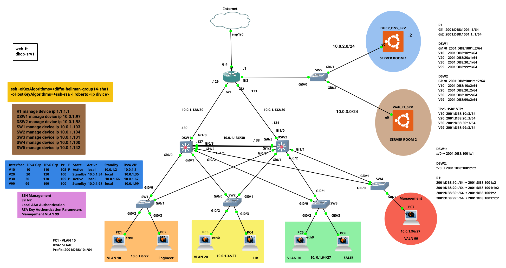

# CCNA Enterprise Branch Office Lab

Enterprise-style network lab built in **GNS3** to practice, integrate, verify, and document technologies from the **Cisco CCNA 200-301** curriculum.

The project models a branch-office environment with redundant distribution switching, multiple departmental VLANs, centralized network services, IPv4/IPv6 dual-stack operation, remote management, monitoring, and security controls.

The lab is developed incrementally. Each major implementation or troubleshooting milestone is documented and version-controlled using Git and GitHub.

---

## Network Topology



The topology uses a hierarchical enterprise design consisting of:

- Enterprise edge router
- Redundant Layer 3 distribution switches
- Multiple access switches
- Engineering, Human Resources, Sales, and Management VLANs
- Centralized DHCP/DNS services
- Web and FTP services
- Dedicated management workstation
- Centralized AAA server
- Internet connectivity
- IPv4 and IPv6 infrastructure

---

## Project Objectives

The purpose of this project is to move beyond isolated command exercises and build a functioning network in which multiple CCNA technologies operate together.

The lab is used to practice:

- Network design
- Cisco IOS configuration
- Configuration verification
- Troubleshooting methodology
- Routing and switching
- High availability
- Network services
- Device management
- Network monitoring
- IPv6
- Security
- Technical documentation

---

## Current Architecture

### Enterprise Edge

**R1** provides:

- IPv4 and IPv6 routing
- Internet connectivity
- NAT/PAT
- Static NAT
- OSPFv2 connectivity
- IPv6 static routing
- Router-on-a-stick connectivity toward server VLANs
- Network management services

### Distribution Layer

**DSW1** and **DSW2** provide:

- Layer 3 switching
- Inter-VLAN routing
- IPv4 HSRP
- IPv6 HSRPv2
- VLAN SVI gateways
- Redundant distribution connectivity
- Routing toward R1
- EtherChannel
- Rapid PVST+ participation

### Access Layer

The access layer consists of:

- SW1 — Engineering
- SW2 — Human Resources
- SW3 — Sales
- SW4 — Management
- SW5 — Server access

---

## VLAN Design

| VLAN | Purpose                  | IPv4 Network   | IPv6 Network       |
| ---: | ------------------------ | -------------- | ------------------ |
|   10 | Engineering              | `10.0.1.0/27`  | `2001:DB8:10::/64` |
|   20 | Human Resources          | `10.0.1.32/27` | `2001:DB8:20::/64` |
|   30 | Sales                    | `10.0.1.64/27` | `2001:DB8:30::/64` |
|   99 | Management               | `10.0.1.96/27` | `2001:DB8:99::/64` |
|  200 | Server Network           | `10.0.2.0/24`  | —                  |
|  300 | Web / FTP Server Network | `10.0.3.0/24`  | —                  |

Detailed addressing information is available in:

[`docs/addressing-plan.md`](docs/addressing-plan.md)

---

## Technologies Implemented

### Layer 2

- VLANs
- Access ports
- 802.1Q trunking
- Native VLAN
- Rapid PVST+
- EtherChannel using LACP
- Layer 2 redundancy
- STP root-bridge distribution

### Layer 3

- Inter-VLAN routing
- Routed switch interfaces
- IPv4 static routing
- OSPFv2
- IPv4 HSRP
- IPv6 addressing
- IPv6 static routing
- IPv6 HSRPv2
- Dual-stack IPv4/IPv6 operation

### IPv6

- Global unicast addressing
- Link-local addressing
- Neighbor Discovery Protocol
- Router Solicitation
- Router Advertisement
- SLAAC
- IPv6 routing tables
- IPv6 static routes
- IPv6 HSRPv2
- IPv6 first-hop redundancy
- IPv6 inter-VLAN forwarding through HSRP virtual gateways

### Network Services

- DHCP
- DHCP relay
- DNS
- NTP
- NAT/PAT
- Static NAT
- FTP
- Web services

### Management and Monitoring

- SSHv2
- Centralized TACACS+ authentication
- Local fallback and local-only console recovery
- TACACS+ EXEC authorization and accounting
- SNMP
- SNMP traps
- Syslog
- NTP synchronization
- Centralized management workstation
- Configuration backup through FTP

### Security

- Standard and extended ACLs
- Restricted SSH access
- Centralized TACACS+ AAA
- TACACS+ privilege-level 15 command authorization
- Local authentication fallback and console recovery
- NAT boundary controls
- Port Security on endpoint-facing access ports
- Sticky secure MAC learning on user access ports
- Static secure MAC assignments on management and server ports
- Restrict and Shutdown violation policies based on endpoint role
- DHCP Snooping on access-layer client and server VLANs
- DHCP Snooping trusted/untrusted port boundaries and rate limiting
- Dynamic ARP Inspection on user and management access VLANs
- DHCP Snooping binding-table validation for DAI

Centralized AAA is implemented across R1, DSW1, DSW2, and SW1 through SW5 using the `AUT-SRV-AAA` appliance at `10.0.1.106/27` in Management VLAN 99.

The AAA design was verified for centralized SSH authentication, EXEC authorization, privilege-level 15 command authorization, local fallback during TACACS+ server unavailability, local-only console recovery, and EXEC session accounting.

Port Security is implemented and verified on the endpoint-facing access ports of SW1 through SW5. User-facing ports use one sticky secure MAC address with Restrict mode, while management and server-facing ports use one statically configured secure MAC address with Shutdown mode and manual recovery after a violation.

DHCP Snooping is implemented and verified across the access layer. The deployment includes trusted uplinks and server-facing paths, untrusted endpoint ports, DHCP binding-table learning, rate limiting, rogue DHCP server protection, and DHCP source-MAC/chaddr consistency validation.

Dynamic ARP Inspection is implemented and verified on SW1 through SW4 for VLANs 10, 20, 30, and 99. DAI uses the DHCP Snooping binding table to validate ARP traffic on untrusted endpoint-facing ports while infrastructure-facing uplinks are explicitly trusted.

---

## Centralized AAA

Network-device administration is centralized through the `AUT-SRV-AAA` appliance.

| Component        | Value             |
| ---------------- | ----------------- |
| AAA Server       | `AUT-SRV-AAA`     |
| IPv4 Address     | `10.0.1.106/27`   |
| VLAN             | `99 - Management` |
| Default Gateway  | `10.0.1.99`       |
| Connected Port   | `SW4 Gi0/3`       |
| Primary Protocol | `TACACS+`         |
| Transport        | `TCP/49`          |

TACACS+ has been deployed and verified on R1, DSW1, DSW2, and SW1 through SW5.

The administrative design provides:

- Centralized SSH login authentication
- Local authentication fallback when TACACS+ is unavailable
- Local-only console authentication for recovery
- TACACS+ EXEC authorization
- Privilege-level 15 command authorization
- TACACS+ EXEC session accounting

Testing also included a restricted TACACS+ account. Operational `show` commands were permitted while configuration access was denied through command authorization.

EXEC accounting was verified through TACACS+ shell START and STOP records.

Sensitive TACACS+ shared secrets and account passwords are intentionally excluded from repository documentation and sanitized configurations.

Detailed AAA verification is available in:

[`verification/aaa-verification.txt`](verification/aaa-verification.txt)

---

## Port Security

Port Security is deployed on endpoint-facing access interfaces across SW1 through SW5 to restrict unauthorized Layer 2 access.

The final policy is based on endpoint role:

| Endpoint Type | Maximum Secure MACs | Secure MAC Method | Violation Mode | Recovery Policy          |
| ------------- | ------------------: | ----------------- | -------------- | ------------------------ |
| User PCs      |                   1 | Sticky            | Restrict       | Port remains operational |
| Management PC |                   1 | Static            | Shutdown       | Manual recovery          |
| Servers       |                   1 | Static            | Shutdown       | Manual recovery          |

User access ports on SW1, SW2, and SW3 use sticky learning with Restrict mode. This blocks traffic from unauthorized source MAC addresses while keeping the interface operational and providing violation counters and notifications.

The dedicated management workstation and server-facing ports on SW4 and SW5 use statically configured secure MAC addresses with Shutdown mode. A security violation places the affected interface into the err-disabled state, and the final design requires an administrator to verify that the cause has been removed before manually restoring service.

Testing validated:

- Shutdown, Restrict, and Protect violation behavior
- Secure MAC address limits
- Sticky secure MAC persistence
- Static secure MAC assignments
- Violation counters and Port Security Syslog messages
- Manual recovery from a Port Security shutdown
- Temporary automatic ErrDisable Recovery
- Repeated violations when the unauthorized endpoint remained connected after automatic recovery
- SecureDynamic MAC removal after an interface went down
- Conversion from SecureDynamic to SecureConfigured
- DHCP failure when unauthorized client frames were discarded by Port Security

Detailed Port Security verification is available in:

[`verification/port-security-verification.txt`](verification/port-security-verification.txt)

---

## DHCP Snooping

DHCP Snooping is deployed at the access layer to establish trusted DHCP paths and protect client VLANs from unauthorized DHCP server traffic.

The final deployment uses:

- SW1 through SW4: DHCP Snooping on VLANs 10, 20, 30, and 99
- SW1 through SW4: trusted infrastructure uplinks and untrusted endpoint-facing ports
- SW5: DHCP Snooping on VLANs 99, 200, and 300
- SW5 Gi0/0 trusted toward R1 because relayed DHCP messages arrive with a nonzero `giaddr`
- SW5 Gi0/1 trusted toward the legitimate DHCP/DNS server
- DHCP Snooping rate limiting on SW1 Gi0/2 at 10 packets per second

Testing validated DHCP binding-table learning, rate-limit err-disable behavior, rogue DHCP OFFER rejection on an untrusted port, and Ethernet source-MAC versus DHCP `chaddr` consistency checking.

During implementation, the IOSvL2/GNS3 distribution-switch image failed to relay DHCP through an SVI when DHCP Snooping was enabled on the relay VLAN. Because DHCP Snooping and SVI relay are conceptually compatible, the behavior was documented as a platform limitation. DSW1 and DSW2 therefore retain DHCP Snooping globally enabled without client VLAN inspection.

Detailed DHCP Snooping verification is available in:

[`verification/dhcp-snooping-verification.txt`](verification/dhcp-snooping-verification.txt)

---

## Dynamic ARP Inspection

Dynamic ARP Inspection is deployed on SW1 through SW4 for VLANs 10, 20, 30, and 99.

The final trust model uses:

- Gi0/0 and Gi0/1 as trusted infrastructure-facing uplinks
- Gi0/2 and Gi0/3 as untrusted endpoint-facing interfaces
- The default DAI untrusted-interface ARP rate of 15 packets per second
- DHCP Snooping bindings as the validation source for dynamically addressed clients

Legitimate ARP operation was verified through normal client-to-HSRP gateway connectivity. A forged ARP request from PC7 on SW4 Gi0/2 used the real Ethernet source MAC with a false sender IP address. DAI rejected the packet, generated a `DHCP_SNOOPING_DENY` Syslog message, and incremented the VLAN 99 DAI drop counter.

Testing also demonstrated the importance of the DAI trust boundary: infrastructure SVI ARP traffic was initially rejected while uplinks were untrusted because static SVI addresses do not appear in the DHCP Snooping binding table. Trusting the infrastructure-facing uplinks resolved the condition.

Detailed DAI verification is available in:

[`verification/dai-verification.txt`](verification/dai-verification.txt)

---

## High Availability

HSRP version 2 provides redundant first-hop gateways across DSW1 and DSW2 for both IPv4 and IPv6.

The final design uses a consistent HSRP group-numbering convention:

- **IPv4 HSRP group = VLAN ID**
- **IPv6 HSRP group = VLAN ID + 100**

The preferred Active gateway is distributed between DSW1 and DSW2 and aligned with the Rapid PVST+ root bridge for each VLAN.

| VLAN | IPv4 Group | IPv6 Group | Preferred Active | STP Root |
| ---: | ---------: | ---------: | ---------------- | -------- |
|   10 |         10 |        110 | DSW1             | DSW1     |
|   20 |         20 |        120 | DSW2             | DSW2     |
|   30 |         30 |        130 | DSW1             | DSW1     |
|   99 |         99 |        199 | DSW2             | DSW2     |

This alignment keeps the preferred Layer 2 forwarding path and Layer 3 first-hop gateway on the same distribution switch.

The IPv4 virtual gateways are:

| VLAN | IPv4 Virtual Gateway |
| ---: | -------------------- |
|   10 | `10.0.1.3`           |
|   20 | `10.0.1.35`          |
|   30 | `10.0.1.67`          |
|   99 | `10.0.1.99`          |

The IPv6 HSRP global virtual gateways are:

| VLAN | IPv6 Virtual Gateway |
| ---: | -------------------- |
|   10 | `2001:DB8:10::3`     |
|   20 | `2001:DB8:20::3`     |
|   30 | `2001:DB8:30::3`     |
|   99 | `2001:DB8:99::3`     |

Detailed verification is available in:

[`verification/hsrp-verification.txt`](verification/hsrp-verification.txt)

Detailed topology information is available in:

[`docs/topology.md`](docs/topology.md)

---

## IPv6 Lab Notes

The network was extended from IPv4-only operation to dual-stack IPv4/IPv6.

IPv6 connectivity has been successfully verified across:

- Routed R1-to-distribution links
- VLAN 10
- VLAN 20
- VLAN 30
- VLAN 99
- Inter-VLAN routing
- R1-to-VLAN connectivity

SLAAC, Router Advertisements, and Neighbor Discovery were verified using Linux endpoints.

IPv6 HSRPv2 functionality was verified, including:

- Active/Standby election
- Priority
- Preemption
- Global virtual IPv6 addressing
- Virtual link-local gateway addressing
- Client default-gateway learning through Router Advertisements
- First-hop redundancy
- IPv6 forwarding through the HSRP virtual gateway

During development, IPv6 inter-VLAN forwarding through the HSRP virtual gateway initially failed under the original HSRP design.

The issue was investigated by rebuilding the HSRP configuration using consistent group numbering and aligning IPv4 HSRP, IPv6 HSRP, and spanning-tree gateway placement.

After the redesign, IPv6 hosts successfully learned the new HSRP virtual link-local gateways through Router Advertisements and successfully forwarded traffic between VLANs.

The earlier hypothesis that the failure represented an inherent IOSvL2/GNS3 HSRPv2 forwarding limitation was therefore disproved through testing.

Detailed IPv6 evidence is available in:

[`verification/ipv6-verification.txt`](verification/ipv6-verification.txt)

---

## Troubleshooting Approach

The lab is intentionally used to reproduce and diagnose faults.

Troubleshooting activities have included:

- Missing static routes
- Incorrect interface addressing
- OSPF route propagation
- VLAN and trunk verification
- HSRP election behavior
- DHCP and DNS connectivity
- NAT and ACL troubleshooting
- SNMP community mismatches
- Syslog connectivity
- SSH RSA-key problems
- Legacy SSH algorithm negotiation
- IPv6 SLAAC and Router Advertisement verification
- IPv6 HSRPv2 forwarding investigation
- HSRP group redesign
- HSRP and STP path alignment
- TACACS+ authentication and local-fallback behavior
- TACACS+ command authorization
- SSH RSA-key regeneration on DSW2
- Port Security Shutdown, Restrict, and Protect behavior
- Port Security err-disabled interface recovery
- Unauthorized endpoint DHCP failure caused by Layer 2 Port Security
- SecureDynamic and SecureConfigured MAC behavior
- DHCP Snooping with SVI-based DHCP relay on IOSvL2/GNS3
- DHCP Snooping nonzero `giaddr` trust behavior on SW5
- DHCP Snooping rate-limit err-disable behavior
- Rogue DHCP server response rejection
- DHCP Ethernet source-MAC and `chaddr` mismatch validation
- DAI trust-boundary behavior for infrastructure SVI ARP traffic
- Forged ARP rejection using DHCP Snooping bindings

The troubleshooting process follows a layered approach rather than changing configurations randomly.

Operational verification evidence is documented under:

[`verification/`](verification/)

---

## Repository Structure

```text

ccna-enterprise-branch-office/

│

├── README.md

│

├── configs/

│   └── Sanitized Cisco device configurations

│

├── diagrams/

│   └── enterprise-branch-office-topology.png

│

├── docs/

│   ├── addressing-plan.md

│   └── topology.md

│

└── verification/

    ├── README.md

    ├── etherchannel-verification.txt

    ├── hsrp-verification.txt

    ├── aaa-verification.txt

    ├── ipv6-verification.txt

    ├── ospf-verification.txt


    ├── port-security-verification.txt

    ├── dhcp-snooping-verification.txt

    ├── dai-verification.txt

    └── spanning-tree-verification.txt

```

Large GNS3 appliance files, virtual disks, IOS images, and runtime data are intentionally excluded from the repository.

---

## Documentation

### Addressing Plan

Detailed IPv4 and IPv6 addressing:

[`docs/addressing-plan.md`](docs/addressing-plan.md)

### Network Topology

Detailed architecture and device-role documentation:

[`docs/topology.md`](docs/topology.md)

### Verification Evidence

Operational configuration and troubleshooting evidence:

[`verification/`](verification/)

---

## Verification Evidence

The current verification package documents operational testing for several core technologies.

| Technology                | Evidence                                                                                     |
| ------------------------- | -------------------------------------------------------------------------------------------- |
| HSRPv2                    | [`verification/hsrp-verification.txt`](verification/hsrp-verification.txt)                   |
| IPv6 / SLAAC / NDP        | [`verification/ipv6-verification.txt`](verification/ipv6-verification.txt)                   |
| OSPFv2                    | [`verification/ospf-verification.txt`](verification/ospf-verification.txt)                   |
| LACP EtherChannel         | [`verification/etherchannel-verification.txt`](verification/etherchannel-verification.txt)   |
| Rapid PVST+               | [`verification/spanning-tree-verification.txt`](verification/spanning-tree-verification.txt) |
| Centralized AAA / TACACS+ | [`verification/aaa-verification.txt`](verification/aaa-verification.txt)                     |
| Port Security             | [`verification/port-security-verification.txt`](verification/port-security-verification.txt) |
| DHCP Snooping             | [`verification/dhcp-snooping-verification.txt`](verification/dhcp-snooping-verification.txt) |
| Dynamic ARP Inspection    | [`verification/dai-verification.txt`](verification/dai-verification.txt)                     |

The verification methodology and planned evidence are documented in:

[`verification/README.md`](verification/README.md)

Additional verification evidence will be added as other implemented technologies are formally captured and sanitized for publication.

---

## Project Development

The lab is version-controlled using Git.

Major additions are committed individually so that the repository history reflects how the environment evolves.

Examples of project milestones include:

```text

Initial repository structure

        ↓

IPv4 / IPv6 addressing documentation

        ↓

Topology documentation

        ↓

Topology diagram

        ↓

Device configurations

        ↓

Network verification evidence

        ↓

Centralized TACACS+ AAA

        ↓

Layer 2 security

        ↓

Additional CCNA features

```

This allows future changes to be documented and pushed to GitHub without duplicating the full GNS3 runtime environment.

---

## Security and Repository Hygiene

The public portfolio version of the project will not include:

- Passwords
- Enable secrets
- Private SSH keys
- Authentication tokens
- GitHub personal access tokens
- Sensitive SNMP community strings
- TACACS+ shared secrets and account passwords
- Production credentials
- Cisco IOS image files

Configuration and verification files are sanitized before publication.

The repository remains subject to a final credential and Git-history audit before being made public.

---

## Current Project Status

| Area                          | Status      |
| ----------------------------- | ----------- |
| Enterprise topology           | Implemented |
| IPv4 addressing               | Verified    |
| IPv6 addressing               | Verified    |
| VLANs and trunking            | Implemented |
| Inter-VLAN routing            | Verified    |
| Rapid PVST+                   | Verified    |
| LACP EtherChannel             | Verified    |
| OSPFv2                        | Verified    |
| IPv4 HSRP                     | Verified    |
| IPv6 HSRPv2                   | Verified    |
| IPv6 HSRP forwarding          | Verified    |
| SLAAC / Router Advertisements | Verified    |
| IPv6 Neighbor Discovery       | Verified    |
| IPv6 static routing           | Verified    |
| DHCP / DNS                    | Verified    |
| NAT / PAT                     | Verified    |
| ACLs                          | Implemented |
| NTP                           | Verified    |
| SNMP / traps                  | Verified    |
| Syslog                        | Verified    |
| SSH                           | Verified    |
| Centralized TACACS+ AAA       | Verified    |
| TACACS+ command authorization | Verified    |
| Local AAA fallback            | Verified    |
| TACACS+ EXEC accounting       | Verified    |
| FTP configuration backup      | Verified    |
| Port Security                 | Verified    |
| DHCP Snooping                 | Verified    |
| Dynamic ARP Inspection        | Verified    |
| Security hardening            | In progress |
| Portfolio documentation       | In progress |

---

## Next Development Areas

Port Security, DHCP Snooping, and Dynamic ARP Inspection have now been implemented and verified.

Planned additions include:

- Additional device-hardening controls
- Remaining CCNA switching and infrastructure verification
- Wireless implementation and verification in Cisco Packet Tracer
- Network automation and RESTCONF exercises

Additional verification evidence will also be captured for technologies that are already operational but do not yet have dedicated verification files.

Only features that are actually implemented and verified will be marked as complete.

---

## About This Project

This project was created as a practical companion to CCNA study.

Its purpose is not only to demonstrate Cisco IOS commands, but to show how switching, routing, redundancy, IPv6, services, security, monitoring, and troubleshooting operate together inside a functioning enterprise-style network.
